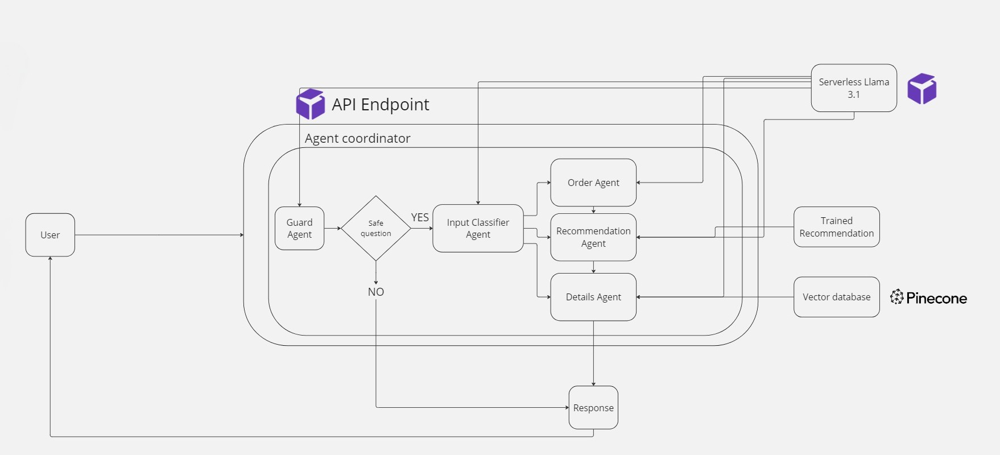

# Coffee Shop Customer Service Chatbot 🚀☕️

Welcome to the Coffee Shop Customer Service Chatbot project! This repository contains the code, resources, and instructions to build an AI-powered chatbot designed to enhance customer experiences in a coffee shop app. Leveraging the power of LLMs (Large Language models), Natural Language Processing (NLP), and RunPod's infrastructure, this chatbot can assist with taking orders, answering detailed menu queries, and providing personalized product recommendations.

# 🎯 Project Overview
The goal of this project is to create a smart, **agent-based chatbot** that can:
* Handle real-time customer interactions with the chatbot including orders.
* Answer questions about menu items, including ingredients and allergens through a **Retreival augmented Generation (RAG) system**.
* Provide personalized product recommendations through a **market basket analysis recommendation engine**.
* Guide customers through a seamless order process, ensuring accurate and structured order details.
* Block irrelevant or harmful queries using a Guard Agent for safe and relevant interactions.

## 🔧 What's in the Project
This project includes:  
* A personal LLM deployment powered by RunPod.  
* An agent-based system featuring specialized agents such as Order Taking, Details, and Guard agents.  
* A vector database setup to store coffee shop menu and product information.  
* Implementation of Retrieval-Augmented Generation (RAG) for detailed and accurate responses.  
* A trained and deployed recommendation engine. 

## 🧠 Chatbot Agent Architecture


The chatbot in this project is designed using a modular agent-based architecture, where each agent is responsible for a specific task, ensuring a seamless and efficient interaction between the user and the coffee shop’s services. This architecture enables the chatbot to perform complex actions by delegating tasks to specialized agents, making the system highly flexible, scalable, and easy to extend.

### 🤖 Key Agents in the System:
1. **Guard Agent:**
This agent acts as the first line of defense. It monitors all incoming user queries and ensures that only relevant and safe messages are processed by the other agents. It blocks inappropriate, harmful, or irrelevant queries, protecting the system and ensuring smooth conversations with users.
2. **Order Taking Agent:**
This agent is responsible for guiding customers through the order placement process. It uses chain-of-thought prompt engineering to simulate human-like reasoning, ensuring the order is accurately structured and all customer preferences are captured. It ensures that the chatbot gathers all necessary order details in a logical, step-by-step process, enhancing the reliability of the final order.
3. **Details Agent (RAG System):**
Powered by a Retrieval-Augmented Generation (RAG) system, the Details Agent answers specific customer questions about the coffee shop, including menu details, ingredients, allergens, and other frequently asked questions. It retrieves relevant data stored in the vector database and combines it with language generation capabilities to provide clear and precise responses.
4. **Recommendation Agent:**
This agent handles personalized product recommendations by working with the market basket recommendation engine. Triggered by the Order Taking Agent, it analyzes the user's current order or preferences and suggests complementary items. This agent aims to boost upselling opportunities or help users discover new products they might like.
5. **Classification Agent:**
This is the decision-making agent. It classifies incoming user queries and determines which agent is best suited to handle the task. By categorizing user intents, it ensures that queries are routed efficiently, whether the user is asking for recommendations, placing an order, or inquiring about specific menu details.

### ⚙️ How the Agents Work Together
The agents work collaboratively in a pipeline architecture to process user inputs:

1. A customer query is received and first assessed by the Guard Agent.
2. If valid, the Classification Agent determines the intent behind the user query (e.g., placing an order, asking about a product, or requesting a recommendation).
3. The query is then forwarded to the appropriate agent:
    * The Order Taking Agent handles order-related queries.
        * Order Agent can forward the order to the recommendation agent to try and upsell the user near the end of their order.
    * The Details Agent fetches specific menu information.
    * The Recommendation Agent suggests complementary products.


# 📂 Directory Structure
This folder contains the Python code and notebooks necessary for building and deploying the chatbot system for the coffee shop app. The code is organized into several components, each serving a specific function within the overall project.

```bash
├── coffee_shop_customer_service_chatbot  
│   ├── api/               # Chatbot API for agent-based system
│   ├── dataset/           # Dataset for training recommendation engine    
│   ├── products/          # Product data (names, prices, descriptions, images)   
│   ├── build_vector_database.ipynb             # Builds vector database for RAG model      
│   ├── recommendation_engine_training.ipynb    # Trains recommendation engine 
```

## 📚 Components Overview
### API
This folder contains the code for the API that handles requests to the chatbot agent system.
### Dataset
This folder includes the downloaded dataset from Kaggle used for training the recommendation engine. It serves as the foundation for generating personalized product suggestions.
### Products
Contains product information, including names, prices, descriptions, and images. This data is essential for the chatbot's responses.
### Notebooks
#### build_vector_database.ipynb: 
A Jupyter notebook that constructs the vector database for the Retrieval-Augmented Generation (RAG) model, facilitating efficient data retrieval for the chatbot.
#### recommendation_engine_training.ipynb: 
A Jupyter notebook that trains the market basket analysis recommendation model, which is used by the recommendation agent to provide personalized product suggestions.


## 🚀 Getting Started
To set up the project and run the notebooks, follow these steps:

1. **Install Requirements**:  
   Ensure you have the necessary dependencies installed by running:

   ```bash
   pip install -r requirements.txt
    ```

2. **Create a Huggingface account**:
    * Create a [Hugging Face](https://huggingface.co)
    * Choose an LLM model and If necessary agree to the terms of use for the model you are going to use (necessary for LLama 3). In this project I used [LLama 3](https://huggingface.co/meta-llama/Llama-3.1-8B-Instruct).
    * Create a Hugging face account token. You are going to need when setting up the Chatbot on Runpod.
    * Create .env file `coffee_customer_service_chatbot` folder and add the enviroement variable.
    <br>

    ```
    MODEL_NAME=<your_chosen_hugginface_model>
     ```

3. **Create a RunPod Account**:
    * Sign up for a [RunPod](https://runpod.io) account.
    * Create a ChatBot endpoint and an embedding endpoint.
    * Obtain your RunPod token and fill in the .env file with the following:
    <br>

    ```
    RUNPOD_TOKEN=<your_runpod_token>
    RUNPOD_CHATBOT_URL=<your_chatbot_endpoint>
    RUNPOD_EMBEDDING_URL=<your_embedding_endpoint>
    ```

4. **Create a Pinecone Account**:
    * Sign up for a Pinecone account.
    * Copy and paste your Pinecone API key into the .env file:
    <br>

    ```
    PINECONE_API_KEY=<your_pinecone_api_key>
    PINECONE_INDEX_NAME=<your_index_name>
    ```

5. **Run Notebooks** :
    * You are now ready to run each Jupyter notebook without any issues. Open the notebooks and execute the cells as needed.

## 🔗 Refrence Links
* [RunPod](https://www.runpod.io/): RunPod Official Site - Infrastructure for deploying and scaling machine learning models.
* [Kaggle Dataset](https://www.kaggle.com/datasets/ylchang/coffee-shop-sample-data-1113): Source of the dataset used for training the recommendation engine.
* [Hugging Face](https://huggingface.co/meta-llama/Llama-3.1-8B-Instruct): Hugging Face Models - Repository for Llama LLms, a state-of-the-art NLP model used in the project.
* [Pinecone](https://docs.pinecone.io/guides/get-started/quickstart): Pinecone Documentation - Documentation for the vector database used in the project.